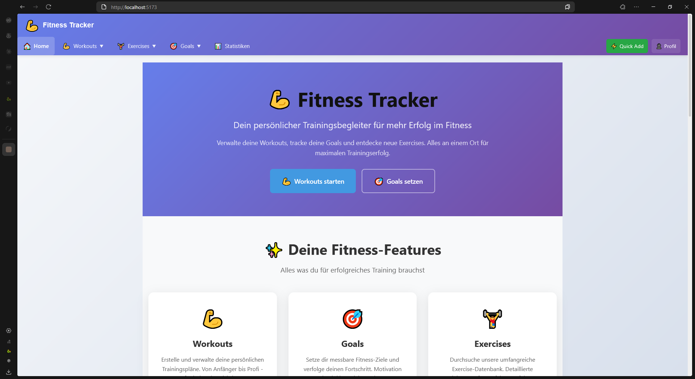
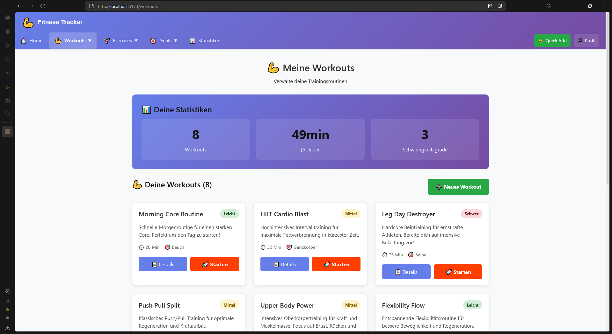
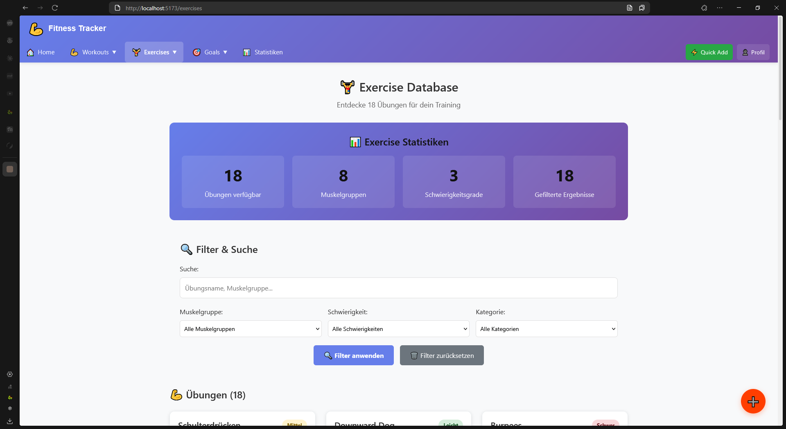
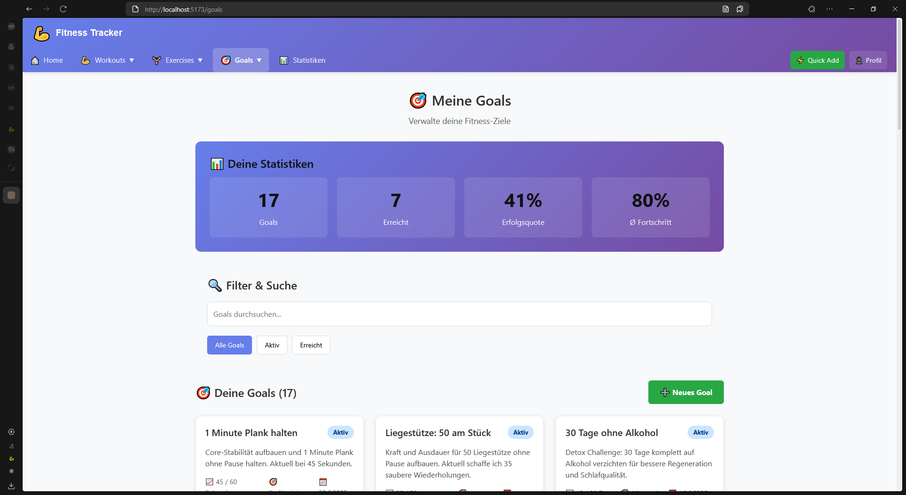
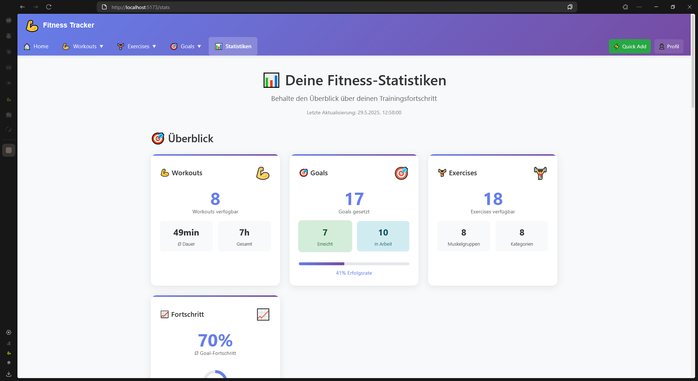
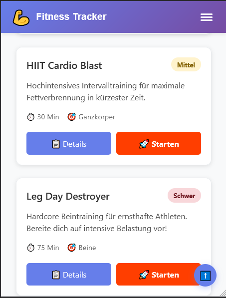

# README.md

## Fitness Tracker
Moderne Fitness-App für Workout-, Exercise- und Goal-Management

**Live Demo:** https://fitness-tracker-zhaw.netlify.app/

## 📋 Übersicht

Der Fitness Tracker ist eine vollständige Web-Anwendung zur Verwaltung von Fitness-Aktivitäten. Mit einem modernen UI/UX Design und umfassenden Features für Workout-Planung, Exercise-Management und Goal-Tracking.

## ✨ Hauptfunktionen

### 💪 Workout Management

- Erstelle und verwalte personalisierte Trainingspläne
- Kategorisierung nach Schwierigkeit und Zielmuskulatur
- Detaillierte Workout-Ansichten mit Exercise-Integration

### 🏋️ Exercise Database

- Umfangreiche Exercise-Datenbank mit über 50 Übungen
- Filterung nach Muskelgruppen und Schwierigkeit
- Detaillierte Anleitungen und Kategorisierung

### 🎯 Goal Tracking

- Setze und verfolge messbare Fitness-Ziele
- Progress-Tracking mit visuellen Fortschrittsbalken
- Verschiedene Goal-Typen (Gewichtsverlust, Kraftaufbau, Ausdauer, etc.)

### 📊 Statistics Dashboard

- Umfassende Statistiken und Analytics
- MongoDB Aggregation Pipelines für komplexe Datenauswertung
- Visuelle Darstellung von Fortschritt und Erfolgsquoten

## 🏗️ Tech Stack

- **Frontend:** Svelte 5 (Runes Mode), SvelteKit
- **Backend:** Node.js, SvelteKit Server Functions
- **Database:** MongoDB Atlas
- **Styling:** CSS3, Bootstrap Components, Custom CSS Grid/Flexbox
- **Deployment:** Netlify (Continuous Deployment)

## 🗄️ Datenmodell

### ER-Diagramm


### Collections

- **workouts** - Trainingspläne mit Exercises-Verknüpfung
- **exercises** - Exercise-Datenbank mit Kategorien
- **goals** - Fitness-Ziele mit Progress-Tracking
- **exercise_categories** - Exercise-Kategorisierung
- **users** - Benutzer-Verwaltung (vorbereitet)
- **workout_sessions** - Session-Tracking (vorbereitet)

## 📱 Screenshots

### Landing Page


*HomePage*

### Workouts Übersicht


*Workout-Management mit Statistics*

### Exercise Database


*Exercise-Datenbank mit erweiterten Filteroptionen*

### Goals Dashboard


*Goal-Tracking mit Progress-Bars und Achievement-Status*

### Statistics Dashboard


*Umfassende Analytics mit MongoDB Aggregations*

### Mobile Responsive



*Vollständig responsive Design für alle Geräte*

## 🚀 Erweiterungen über Grundanforderungen

### 🌙 Dark Mode System

- Vollständiges Dark/Light Theme System mit localStorage Persistence
- Svelte 5 Runes-basierte Theme State Management
- Automatische System-Präferenz Erkennung (OS Dark Mode)
- Smooth Transitions und CSS Custom Properties Architecture
- Responsive Theme Toggle mit Accessibility Features
- Umfassende CSS Variable System für alle UI Komponenten

### 🎯 Goals System

- Vollständiges CRUD für Fitness-Ziele
- Progress-Tracking mit automatischem Achievement-Check
- Verschiedene Goal-Typen mit individueller Validierung
- Visual Progress Indicators

### 📊 Statistics Dashboard

- MongoDB Aggregation Pipelines für komplexe Statistiken
- Real-time Analytics und Erfolgsquoten-Berechnung
- Interactive Charts und Visualisierungen
- Performance Metrics für alle Entitäten

### 🧭 Professional Navigation

- Multi-Level Dropdown-Navigation
- Mobile-optimierte Hamburger-Menüs
- Breadcrumb-Navigation auf Detail-Seiten
- Responsive Design Patterns

### ⚡ Svelte 5 Runes Implementation

- Moderne `$state()` und `$derived()` Patterns
- Reaktive State Management ohne Legacy API
- `$effect()` für Side Effects und Analytics
- Performance-optimierte Component-Architecture

### 🛡️ Advanced Error Handling

- Comprehensive Server-Side Error Management
- Client-Side Validation mit Real-time Feedback
- Graceful Fallbacks bei Datenbank-Fehlern
- User-friendly Error Messages

## 🛠️ Installation & Setup

```bash
# Repository klonen
git clone [repository-url]
cd fitness-tracker

# Dependencies installieren
npm install

# Environment Variables konfigurieren
cp .env.example .env
# MONGODB_URI in .env eintragen

# Development Server starten
npm run dev

# Production Build
npm run build
npm run preview

📦 Deployment

Automatisches Deployment über Netlify:

    Repository: GitHub Integration
    Build Command: npm run build
    Publish Directory: build
    Environment Variables: MONGODB_URI konfiguriert

🔄 TODOs & Geplante Features
🏃‍♂️ Kurzfristig (nächste Iteration)

    Bilder/Medien Integration
        Exercise-GIFs für bessere Visualisierung
        Workout-Thumbnail Images
        Hero-Section Background Images
        App-Logo und Branding

    UI/UX Verbesserungen
        Erweiterte Filter-Optionen
        Bulk-Actions für mehrere Entities
        Drag & Drop für Workout-Exercise Reihenfolge

💪 Mittelfristig (Major Features)

    Workout Sessions System
        Live Session-Tracking während Training
        Timer und Rest-Period Management
        Set/Rep Eingabe in Echtzeit
        Session History und Analytics
        Performance-Vergleiche zwischen Sessions

    User Authentication
        Multi-User Support mit Login/Logout
        Personal Dashboards
        Privacy Settings
        Data Import/Export per User

    Social Features
        Workout Sharing zwischen Usern
        Community Goals und Challenges
        Leaderboards und Achievements
        Comment-System für Workouts

🔮 Langfristig (Advanced Features)

    Mobile App
        React Native oder Progressive Web App
        Offline-Funktionalität
        Push Notifications für Goals
        Wearable Integration (Smartwatch)

    AI & Machine Learning
        Workout-Empfehlungen basierend auf Goals
        Automatische Progress-Prediction
        Form-Check via Computer Vision
        Personalisierte Training-Pläne

    External Integrations
        Fitness-Tracker APIs (Fitbit, Garmin)
        Nutrition Database Integration
        Calendar-Sync für Workout-Planung
        Health App Synchronisation

🧪 Technische Verbesserungen

    Performance Optimizations
        Database Indexing für bessere Query-Performance
        Image Optimization und CDN Integration
        Service Worker für Offline-Capability
        Bundle Size Optimization

    Testing & Quality
        Unit Tests mit Vitest
        E2E Tests mit Playwright
        TypeScript Migration
        ESLint/Prettier Setup

    DevOps & Monitoring
        Error Tracking mit Sentry
        Performance Monitoring
        Automated Testing Pipeline
        Database Backup Strategy

👨‍💻 Entwicklung
## Code-Struktur

```md
src/
├── lib/
│   ├── components/     # Wiederverwendbare Svelte Components
│   │   ├── Navigation.svelte      # Hauptnavigation mit Theme Toggle
│   │   └── ThemeToggle.svelte     # Dark/Light Mode Toggle
│   ├── database/       # MongoDB Models und Connection
│   │   ├── mongodb.js             # Database Connection
│   │   └── models/                # Data Models
│   └── styles/         # Global CSS und Themes
│       └── global.css             # CSS Custom Properties & Theme System
├── routes/
│   ├── +layout.svelte             # App Layout mit Navigation
│   ├── +page.svelte               # Landing Page
│   ├── workouts/                  # Workout CRUD Pages
│   │   ├── +page.server.js        # Server-side Data Loading
│   │   ├── +page.svelte           # Workouts Overview
│   │   ├── create/                # Workout Creation
│   │   └── [id]/                  # Individual Workout Details
│   ├── exercises/                 # Exercise CRUD Pages
│   │   ├── +page.server.js        # Exercise Data & Filtering
│   │   ├── +page.svelte           # Exercise Database
│   │   ├── create/                # Exercise Creation
│   │   └── [id]/                  # Exercise Details & Edit
│   ├── goals/                     # Goals CRUD Pages
│   │   ├── +page.server.js        # Goals Data Management
│   │   ├── +page.svelte           # Goals Dashboard
│   │   ├── create/                # Goal Creation
│   │   └── [id]/                  # Goal Details & Progress
│   ├── sessions/                  # Training Sessions (Coming Soon)
│   │   └── +page.svelte           # Coming Soon Page with Roadmap
│   ├── stats/                     # Statistics Dashboard
│   │   ├── +page.server.js        # MongoDB Aggregation Pipelines
│   │   └── +page.svelte           # Analytics & Visualizations
│   ├── about/                     # About Page
│   ├── help/                      # Help & Support
│   ├── privacy/                   # Privacy Policy
│   └── terms/                     # Terms of Service
└── app.html                       # Main HTML Template
```

Development Guidelines

    Svelte 5 Runes: Verwende $state(), $derived(), $effect()
    Error Handling: Immer try/catch mit user-friendly Messages
    MongoDB: Verwende Aggregation Pipelines für komplexe Queries
    Responsive Design: Mobile-First Approach
    Accessibility: Semantic HTML und ARIA Labels

📄 Lizenz

MIT License - Siehe LICENSE.md für Details
🤝 Contributing

Contributions sind willkommen! Bitte erstelle einen Pull Request mit:

    Klare Beschreibung der Änderungen
    Tests für neue Features
    Dokumentation Updates

Erstellt mit ❤️ und Svelte 5 für das ZHAW Prototyping Modul
